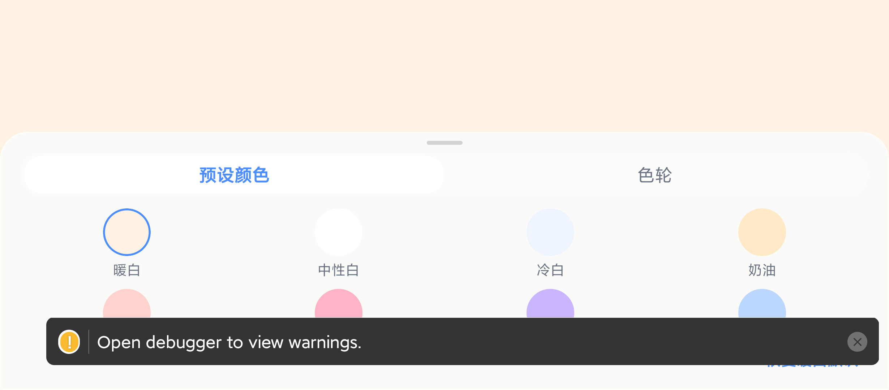
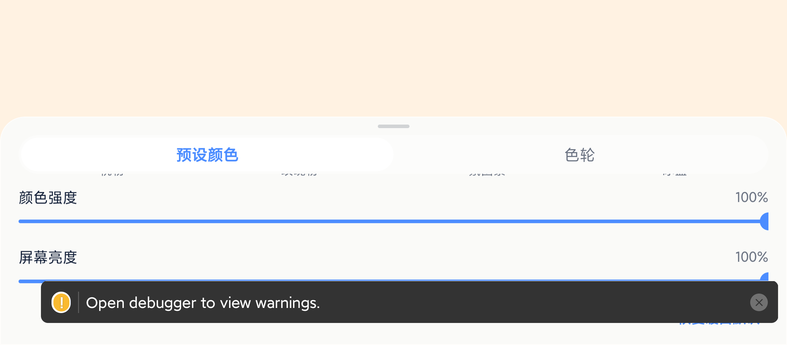

# 夜间补光灯

简体中文 | [English](./README.en.md)

夜间补光灯把第二台 Android 手机变成独立补光灯：主手机负责拍摄，第二台手机负责发光，无需配对、不可远程控制。

打开 App 就是一块全屏的柔光板：轻点屏幕呼出控制面板，选颜色、拉亮度，5 秒不动面板自己收起。适合夜间人像、自拍、静物补光。

## 能做什么

- 全屏补光画布：打开即用，暖白默认（`#FFF2E2`），常亮不锁屏。
- 8 个预设颜色：暖白 / 中性白 / 冷白 / 奶油 / 桃粉 / 玫瑰粉 / 氛围紫 / 冰蓝，一点即换。
- 自定义颜色：HSV 色轮自选任意颜色。
- 两路调节：颜色强度、App 内屏幕亮度，各 0–100%。
- 自动收起：面板 5 秒无操作自动关闭，不挡光。
- 一键恢复：一点回到暖白默认状态。
- 横竖屏可用：旋转不闪退，横屏面板内容可滚动。
- 本地优先：状态记在手机本地，无账号、无配对、无联网（release 包零权限）。





## 最快开始（装到手机上用）

release 包自带界面代码，断网也能打开。打一个包再装上（环境要求见下文）：

```bash
cd android
./gradlew :app:assembleRelease --no-daemon --no-watch-fs
adb install -r app/build/outputs/apk/release/app-release.apk
```

## 从源码构建

环境：Node.js（见 `package.json`）、JDK 17、Android SDK（含 platform-tools）。

```bash
npm install
npm start
```

用 Expo Go 扫码，或连 Android 模拟器 / 真机。改完代码保存即热更新。

门禁（提交前跑）：

```bash
npm run lint && npm run typecheck && npm test
```

### 打正式包（release）

见「最快开始」。补充说明：

- 只改了 `app.json` 等 Expo 配置、还没 `android/` 目录变化时，先跑 `npx expo prebuild --platform android`。
- release 包申请 0 权限（DoD 要求）；debug 包调试需要网络权限，只加在 `android/app/src/debug/`，不影响 release。
- 包名 `com.filllight.nightlamp`，桌面名「夜间补光灯」。

### 调试包连不上 Metro

debug 包启动要连电脑上的 Metro，如果出现红屏 `Unable to load script`：

```bash
npx expo start --port 8081   # 不要加 CI=1，否则 Metro 不监听文件变化
adb -s <手机序列号> reverse tcp:8081 tcp:8081
```

然后在手机上冷启 App（先划掉再打开）。每次插拔手机后，先用 `adb -s <序列号> reverse --list` 确认 8081 映射还在。

小米手机首次 USB 安装，需要在手机上点允许（开发者选项 → USB 安装），电脑端绕不过。

## 文档

- 商店文案：[`docs/store-copy.md`](./docs/store-copy.md)
- 产品计划：[`docs/pm/PRODUCT_PLAN_V1.1.md`](./docs/pm/PRODUCT_PLAN_V1.1.md)
- 测试记录：[`docs/qa/`](./docs/qa/)
- 开发交接（接手先读）：[`docs/handoff/HANDOFF.md`](./docs/handoff/HANDOFF.md)

## 技术说明

Expo（~57）+ React Native + TypeScript 单页应用，`expo-router` 单主页。状态放 `src/state`，面板/色轮/滑条在 `src/components`，设计 token 在 `src/theme`。色盘贴图由 `npm run assets:wheel` 生成。
